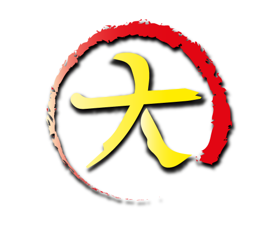

<h1 align="center">
  <br>
  
  <br>
  Friki API
  <br>
</h1>

<h4 align="center">Dai Store business logic</h4>

<p align="center">
  <a href="#description">Description</a> •  
  <a href="#how-to-run">How To Run</a> •  
  <a href="#how-to-test">How To Test</a> •  
  <a href="#features">Features</a> •  
</p>

## Description

- REST API developed in Go with the purpose of being the backend of Dai Store
- Implements Clean Archicture which allows to distribute this project in different logic layers:
  - Infraestructure: dependencies configurations
  - Adapters: dependencies implementations
  - Use cases: business logic
  - Entities: business types

## How To Run

Install dependencies:

```
go get .
```

Run:

```
go run main.go
```

## How To Test

This project reach to program unit tests for use cases which implement the business logic
and for the utils functions that support the app with abstract logic.

```
go test ./... -count=1
```

## Features 

✅: Implemented and tested
⚠️: Implemented and not tested
🔴: Not implemented

- Login:
  - Google OAuth2 ✅

- Middlewares:
  - Authentication with Json Web Token ✅
  - Authorization system ✅

- Permissions: 
  - Create ✅
  - Add resource ✅
  - Authorize ⚠️ 
  - Remove resource 🔴

- Users:
  - Update ✅
  - Get by ID ✅
  - Create ✅

- Addresses: 
  - Create ✅
  - GetByID ✅
  - Update 🔴
  - Delete 🔴


    
    


